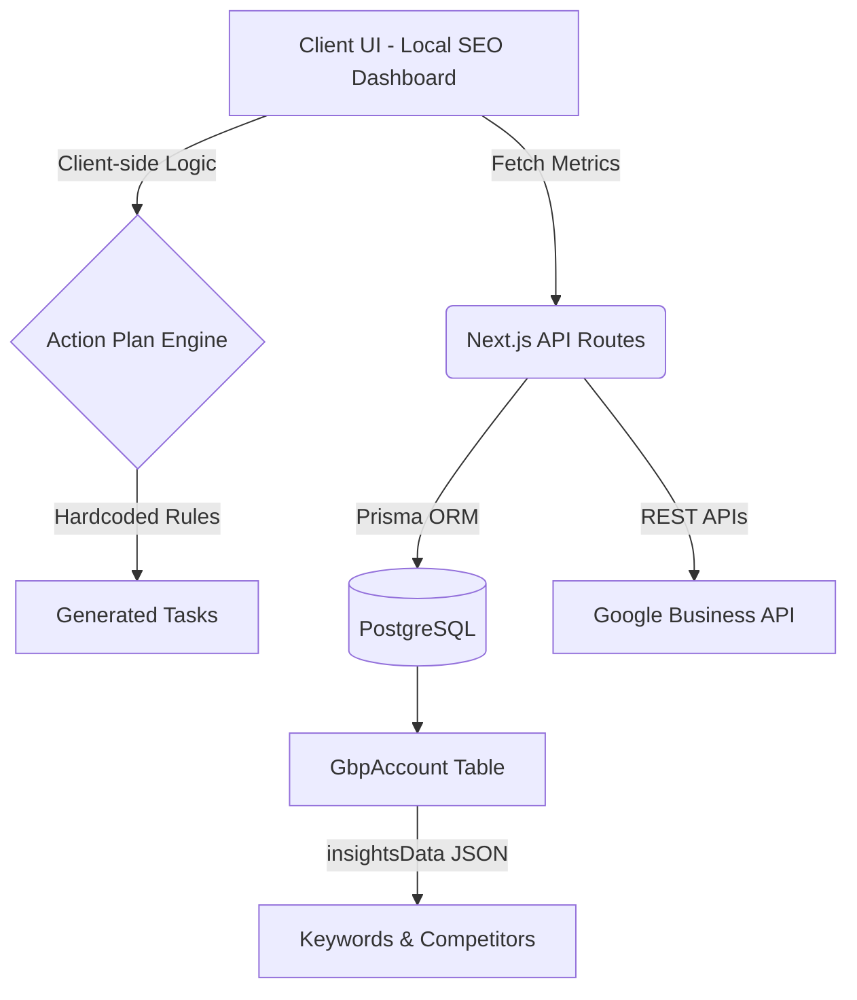

# DocFlo Local SEO Module: Comprehensive Technical & Product Audit
*Prepared for the DocFlo Executive Team by the Lead Local SEO Architect*

---

> [!IMPORTANT]
> **Executive Summary**
> The current Local SEO module serves as an excellent visual prototype and MVP for demonstrating value to clinics. However, it relies heavily on mocked data, client-side rule engines, and superficial UI representations (like the Geo-Grid). To achieve the vision of becoming the "world's best AI platform for Google Business Profile ranking," the module requires a complete architectural overhaul to transition from a static dashboard into an autonomous, data-driven SEO engine.

---

## PART 1: CURRENT ARCHITECTURE

### Current Architecture Overview
DocFlo's Local SEO module is a monolithic Next.js application leveraging Prisma (PostgreSQL) for persistence. The architecture is primarily read-heavy with client-side rendering driving the user experience.

- **Folder Structure**: 
  - UI: `src/app/(dashboard)/local-seo`, `src/app/(dashboard)/gbp`, `src/app/(dashboard)/reviews`
  - APIs: `src/app/api/gbp/*`, `src/app/api/reviews/*`, `src/app/api/cron/*`
- **Database Models**: Relies on `GbpAccount`, `GBPPost`, `Review`, and `AIAgentConfig`. Critically, SEO data (Keywords, Competitors, Insights) is stored as an unstructured JSON blob (`insightsData`) inside the `GbpAccount` table.
- **Background Jobs**: A basic `/api/cron` folder exists, likely for Vercel Cron triggering, but real-time queued workers (like Redis/BullMQ) are missing for heavy scraping or AI generation.
- **Google API Usage**: Uses standard REST calls for OAuth and basic metric fetching. 
- **AI Workflow**: Currently absent in the Local SEO core. The "Action Plan" is generated via a static, hardcoded JavaScript rules engine on the client-side (`src/app/(dashboard)/local-seo/page.tsx`), not via Gemini.

### Architecture Diagram

---

## PART 2: FEATURE INVENTORY

| Feature | Category | Purpose | Status | Technical Notes |
| :--- | :--- | :--- | :--- | :--- |
| **OAuth Connection** | Infrastructure | Link GBP to DocFlo | **Complete** | Standard OAuth flow. |
| **Geo-Grid UI** | Local SEO | Visualize rankings across a map | **Mocked/Broken** | The current map is hardcoded HTML/CSS. It does not ping Maps APIs for true geospatial coordinate rankings. |
| **Keyword Tracking** | Analytics | Track clinic search terms | **Partial** | Stored in JSON blob. Ranks are randomly generated (`Math.random()`) during seeding. No actual SERP scraping is implemented. |
| **Competitor Matrix** | Analytics | Compare clinic against rivals | **Partial** | UI exists to add competitors, but metrics are simulated via math formulas. |
| **Action Plan** | AI/Automation | Provide SEO tasks to doctors | **Partial** | Rules are hardcoded (e.g. `if (daysSinceLastPost > 7)`). Not powered by AI. |
| **Reviews Dashboard** | Engagement | Monitor and reply to reviews | **Complete** | Fully functional with DB persistence. |
| **GBP Posts** | Content | Publish updates to GBP | **Complete** | Supports scheduling and draft states. |

---

## PART 3: USER JOURNEY

### Current Workflow Audit
1. **Connection**: Doctor clicks "Connect Profile" -> OAuth authenticates and creates a `GbpAccount` record.
2. **Analysis**: The system fetches baseline profile data and stores it in `insightsData`.
3. **Insights Generation**: When the user opens the Local SEO dashboard, the client-side React component calculates SEO tasks based on a static 100-point health score algorithm. 
4. **Action**: The doctor manually clicks "Draft AI Post" or "Reply to Reviews", which navigates them to separate modules.

> [!WARNING]
> **Identified Gaps**
> - **Zero Automation**: The system tells the doctor what to do, but doesn't do it for them.
> - **Fake Data**: Rankings and competitor metrics are randomly generated when empty. 
> - **No Feedback Loop**: Completing a task (e.g., posting an update) does not proactively recalculate the SEO score on the server.

---

## PART 4: SEO AUDIT (Best Practices)

Compared against Google's Local Search ranking algorithms, DocFlo's current implementation covers the basics but misses advanced signals.

- **Business Profile Completeness**: Covered (Basic fields available).
- **Categories & Services**: Covered.
- **Reviews & Replies**: Covered (Strong feature).
- **Posts (Freshness)**: Covered.
- **Geo Relevance (Distance)**: **MISSING**. We do not calculate or optimize for proximity polygons.
- **Citation Consistency (NAP)**: **MISSING**. We do not scan external directories (Yelp, Healthgrades, WebMD) for NAP (Name, Address, Phone) consistency.
- **Schema.org / Website Links**: **MISSING**. We do not analyze the clinic's linked website for local schema markup or E-E-A-T medical signals.

---

## PART 5: COMPETITOR ANALYSIS

| Feature | DocFlo (Current) | BrightLocal | Local Falcon | GatherUp |
| :--- | :--- | :--- | :--- | :--- |
| **Review Management** | ✅ | ✅ | ❌ | ✅ |
| **GBP Posts** | ✅ | ❌ | ❌ | ❌ |
| **True Geo-Grid Scanning** | ❌ (Mocked) | ✅ | ✅ | ❌ |
| **Citation Tracking** | ❌ | ✅ | ❌ | ❌ |
| **AI Automated Fixes** | ❌ | ❌ | ❌ | ❌ |

**Competitive Advantage**: Our UI is modern, fast, and vertically integrated for healthcare. 
**Weakness**: Lack of true, data-backed SERP (Search Engine Results Page) scraping. Our Geo-Grid is a UI illusion.

---

## PART 6: GOOGLE RANKING FACTORS MATRIX

Google classifies Local SEO into three pillars: **Relevance, Distance, Prominence**.

| Factor | Classification | Importance | DocFlo Support | How to Improve |
| :--- | :--- | :--- | :--- | :--- |
| **Primary Category** | Relevance | Critical | Basic | AI suggests better secondary categories based on search volume. |
| **Proximity to Searcher** | Distance | Critical | None | Implement true Places API coordinate scanning to identify weak zones. |
| **Review Quantity/Score** | Prominence | High | Excellent | Automate review requests via WhatsApp/SMS integration. |
| **Citations (Directories)** | Prominence | Medium | None | Integrate with Yext or build a custom citation scraper. |
| **Behavioral Signals**| Behavior | High | None | Track click-through rates (CTR) on posts and driving directions via Insights API. |
| **Medical E-E-A-T** | Authority | High | None | Scan doctor's linked website for medical credentials and author bios. |

---

## PART 7: AI AUDIT

Currently, the Local SEO module does **not** utilize Gemini or any LLM for the Action Plan or Scoring. It relies on standard Javascript `if/else` statements.

**Improvement Opportunities:**
1. **Prompt Engineering**: Use Gemini to analyze the clinic's GBP description against top 3 competitors and rewrite it for maximum keyword density.
2. **Post Generation**: Train Gemini on high-converting medical marketing copy to auto-generate weekly GBP posts with images.
3. **Medical Compliance**: Implement a middleware prompt to ensure generated review replies do not violate HIPAA (e.g., never confirming a patient's medical condition in a public reply).

---

## PART 8: DATABASE AUDIT

**Issues Identified in `schema.prisma`:**
1. **JSON Blob Anti-Pattern**: Storing `localSeoKeywords` and `competitors` inside `GbpAccount.insightsData` prevents efficient querying, relational scaling, and historical tracking.
2. **Missing Entities**: We need dedicated tables: `Keyword`, `KeywordRankingHistory`, `Competitor`, and `CompetitorRanking`.
3. **Performance**: Running daily cron jobs to update JSON blobs across 10,000 clinics will cause severe PostgreSQL performance degradation.

---

## PART 9: API AUDIT

The current API (`/api/gbp/local-seo`) is a standard Next.js route.
- **Security**: Good. Leverages robust NextAuth session checking.
- **Rate Limiting**: **Missing**. A malicious user could spam the "Track Keyword" button.
- **Scalability**: Poor. Fetching real rankings requires headless browsers or third-party APIs (like DataForSEO or SerpApi), which take 5-15 seconds. This cannot be done synchronously in a Next.js API route without triggering Vercel's 10-second timeout.

---

## PART 10: UX AUDIT

The UI (`page.tsx`) is exceptional. 
- **Pros**: Beautiful bento-box design, excellent use of Tailwind, intuitive tab structure, highly actionable task lists.
- **Cons**: The Geo-Grid map is a static CSS grid. It needs to be replaced with a real Google Maps JS API instance overlaid with coordinate markers.

---

## PART 11: AUTOMATION AUDIT

Background automation is currently the weakest link. True Local SEO requires continuous, asynchronous monitoring. 

**Required Architecture:**
Need a robust message queue (e.g., Inngest, Upstash Kafka, or BullMQ) to handle:
- Daily SERP rank checking
- Weekly competitor metric scraping
- Automated AI post generation schedules

---

## PART 12: SCORING SYSTEM

**Current State**: 
The SEO score starts at 100 and subtracts points based on arbitrary static rules (e.g., `< 50 reviews = -20 points`).
**Verdict**: Not scientifically valid.

**Future State (AI Driven)**:
Calculate a true "Share of Local Voice" (SoLV). 
`SoLV = (Total Keywords Tracked * Search Volume * CTR based on Rank) / Total Local Market Search Volume`.
Feed this raw data into Gemini to output a personalized 0-100 Health Score.

---

## PART 13: ROADMAP & ESTIMATED PHASES

> [!TIP]
> **Prioritized Implementation Roadmap (Highest to Lowest ROI)**

### Phase 1: Data Integrity & Real Tracking (Quick Wins - 2 Weeks)
1. Migrate Keywords and Competitors out of the JSON blob into relational Prisma tables.
2. Integrate a third-party SERP API (e.g., DataForSEO, SerpApi) to fetch actual keyword rankings instead of `Math.random()`.
3. Update API endpoints to save historical ranking data daily.

### Phase 2: True Geo-Grid (Medium Effort - 3 Weeks)
1. Implement Google Maps JavaScript API in the frontend.
2. Build an asynchronous background job to query the Google Places API in a 3x3 or 5x5 mile radius around the clinic's coordinates for specific keywords.
3. Overlay the ranking nodes on the real map UI.

### Phase 3: AI SEO Agents (High Impact - 4 Weeks)
1. Hook Gemini into the `generateActionPlan()` function.
2. Give Gemini access to the clinic's historical ranking data, competitor metrics, and website content to generate highly personalized, HIPAA-compliant tasks.
3. Build the "Auto-Execute" button where AI automatically completes the task it suggested (e.g., drafting and publishing the GBP post).

### Phase 4: Citation & NAP Management (Enterprise - 6 Weeks)
1. Build a scraper to check Healthgrades, WebMD, Yelp, and Apple Maps for clinic Name, Address, and Phone number consistency.
2. Report inconsistencies to the dashboard.

---

## PART 14: WORLD CLASS VISION (5-Year Outlook)

If tasked to build the world's best platform for healthcare Local SEO, I would build an **Autonomous Local SEO Agent Network**.

Instead of a dashboard that tells doctors what to do, the platform operates invisibly in the background. 
1. **The AI Web Scraper Agent** reads the clinic's EMR/Scheduling software to understand what treatments are most profitable this month.
2. **The AI SEO Agent** automatically researches localized keywords for those specific treatments.
3. **The AI Content Agent** writes, generates images for, and publishes Google Posts weekly targeting those exact treatments.
4. **The Review Agent** instantly replies to patient reviews, adjusting its tone based on the star rating, while adhering strictly to medical privacy laws.

The dashboard would evolve from a "To-Do List" into a "Here is what the AI did for you while you were treating patients" report, proving undeniable, automated ROI.
