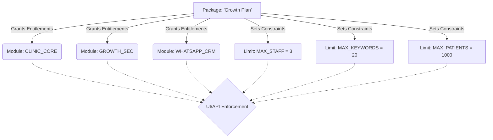

# DocFlo Subscription & Feature Architecture

This document defines the product architecture for DocFlo's Subscription and Feature Management, strictly adhering to the philosophy that doctors buy high-level capabilities (Modules) constrained by volume (Usage Limits), rather than a disjointed list of feature flags.

## 1. Subscription Module Catalog

To keep the commercial offering simple and easy to understand, all existing functionalities are grouped into **four core modules**. 

### Always Enabled (The Foundation)
**Module: Clinic Core**
This is the baseline module available to every doctor on the platform. It provides the essential operating system for their clinic.
*   **Patients**: Core CRM records.
*   **Appointments**: Scheduling and tracking.
*   **Billing**: Invoicing, discounts, payments (Cash, Card, UPI).
*   **Staff**: Receptionist and staff management.
*   **Reviews**: Centralized review monitoring.
*   **Subscription**: Billing and plan management.

### Subscription-Controlled Modules
**Module: Growth & SEO**
For clinics looking to acquire more patients via Google.
*   Google Business Profile (Connection & Management)
*   Local SEO (Keyword Tracking & Competitor Analysis)
*   Scheduled Posts

**Module: WhatsApp CRM**
For clinics looking to streamline patient operations and communication.
*   WhatsApp Inbox
*   Patient Announcements (Operational communication only)

**Module: AI Assistant**
A single, unified AI capability that supercharges the other modules.
*   Includes all underlying agents (Appointment Reminders/Booking, Review Replies, Profile Updater, Ranking Engine) seamlessly integrated into the user experience.

---

## 2. Usage Limit Catalog

Artificial limits are removed from core operations. Limits are only applied to value-scaling resources (seats, audience size, API costs).

### No Artificial Limits (Unlimited)
*   **Billing**: Unlimited bills, receipts, and history.
*   **Reviews**: Unlimited review tracking.
*   **Appointments**: Unlimited appointments.
*   **Patient Announcements**: Unlimited (restricted only by WhatsApp operational rules and the patient limit).
*   **WhatsApp Inbox**: Unlimited conversations.

### Volume Limits (Meters)
*   **`max_staff_seats`**: Limits the number of staff members (e.g., 1, 3, Unlimited).
*   **`max_patients`**: Limits the size of the clinic's CRM database (e.g., 500, 2000, Unlimited).
*   **`max_gbp_locations`**: Limits the number of connected Google Business Profiles (e.g., 1, 3).
*   **`max_tracked_keywords`**: Limits the SEO keyword tracking (e.g., 5, 20).
*   **`max_scheduled_posts_per_month`**: Limits GBP posting frequency (e.g., 4, 15).
*   **`ai_credits_per_month`**: Limits total AI processing across all assistant functions to control LLM costs (e.g., 100, 500).

---

## 3. Module Dependency Diagram

```mermaid
graph TD
    CC[Clinic Core\n(Always Enabled)]
    
    CC --> WA[WhatsApp CRM]
    CC --> GS[Growth & SEO]
    
    WA -.-> |Empowers| AI[AI Assistant]
    GS -.-> |Empowers| AI
    
    classDef core fill:#e2e8f0,stroke:#64748b,stroke-width:2px;
    classDef sub fill:#dbeafe,stroke:#3b82f6,stroke-width:2px;
    classDef ai fill:#f3e8ff,stroke:#a855f7,stroke-width:2px;
    
    class CC core;
    class WA,GS sub;
    class AI ai;
```
*Note: The AI Assistant does not stand alone; it acts as an intelligence layer on top of the WhatsApp CRM and Growth & SEO modules.*

---

## 4. Entitlement Matrix (Module vs Limit)

| Capability Module | Functionality Included | Applied Usage Limits |
| :--- | :--- | :--- |
| **Clinic Core** | Billing, Appointments, Reviews, Patients, Staff | `max_staff_seats`, `max_patients` |
| **WhatsApp CRM** | WhatsApp Inbox, Announcements | None (Inherits `max_patients` limit) |
| **Growth & SEO** | GBP, Local SEO, Scheduled Posts | `max_gbp_locations`, `max_tracked_keywords`, `max_scheduled_posts_per_month` |
| **AI Assistant** | Unified AI capabilities | `ai_credits_per_month` |

---

## 5. Recommended Database Design (Conceptual)

The database schema cleanly separates the subscription definitions from the doctor's active subscription. No code or schema changes are made here, this is strictly conceptual.

```prisma
// Represents a sellable tier (e.g., "Starter", "Growth", "Pro")
model Package {
  id              String
  name            String
  price           Float
  
  // Relations to what the package grants
  modules         PackageModule[]
  limits          PackageLimit[]
  
  doctors         Doctor[]
}

// Grants access to a high-level module capability
model PackageModule {
  packageId       String
  moduleName      ModuleName // Enum: CLINIC_CORE, WHATSAPP_CRM, GROWTH_SEO, AI_ASSISTANT
}

// Defines the numerical limits for a package
model PackageLimit {
  packageId       String
  limitName       LimitName  // Enum: MAX_STAFF, MAX_PATIENTS, MAX_KEYWORDS, etc.
  limitValue      Int?       // Null implies Unlimited
}

// The Doctor's active tenant state
model Doctor {
  id              String
  packageId       String
  subscriptionStatus Status
  
  // Usage tracking (reset monthly or lifetime)
  currentAiCredits   Int @default(0)
  currentPatients    Int @default(0)
}
```

---

## 6. Recommended Permission Architecture

The application UI and API should strictly enforce access based on the conceptual schema above. We completely abandon granular feature flags (e.g., `has_appointment_reminders`, `has_custom_templates`) in favor of Module checks and Limit checks.

**1. Module Checks (For UI Rendering & API Access)**
Used to show/hide entire navigation items and protect API route access.
```typescript
// Example: Hiding the Local SEO tab
if (!hasModule(doctorId, 'GROWTH_SEO')) {
   return <UpsellScreen module="Growth & SEO" />
}
```

**2. Limit Checks (For Action Verification)**
Used to prevent creating/adding resources beyond the paid volume.
```typescript
// Example: Adding a new keyword in Local SEO
const limit = await checkUsageLimit(doctorId, 'MAX_TRACKED_KEYWORDS');
if (limit.current >= limit.max) {
   throw new QuotaExceededError('Upgrade to track more keywords');
}
```

---

## 7. Recommended Subscription Architecture

This flows logically from the package definition down to the user experience.



### Why this design?
1.  **Simplicity**: A clinic owner only has to understand 4 modules and a few volume meters.
2.  **Maintainability**: Engineering does not need to manage 50+ feature flags. If a new Growth & SEO feature is built, it automatically belongs to the `GROWTH_SEO` module.
3.  **Ease of Selling**: "Do you want AI?" (Module). "Do you need to track more keywords?" (Limit). It creates natural upgrade paths.
